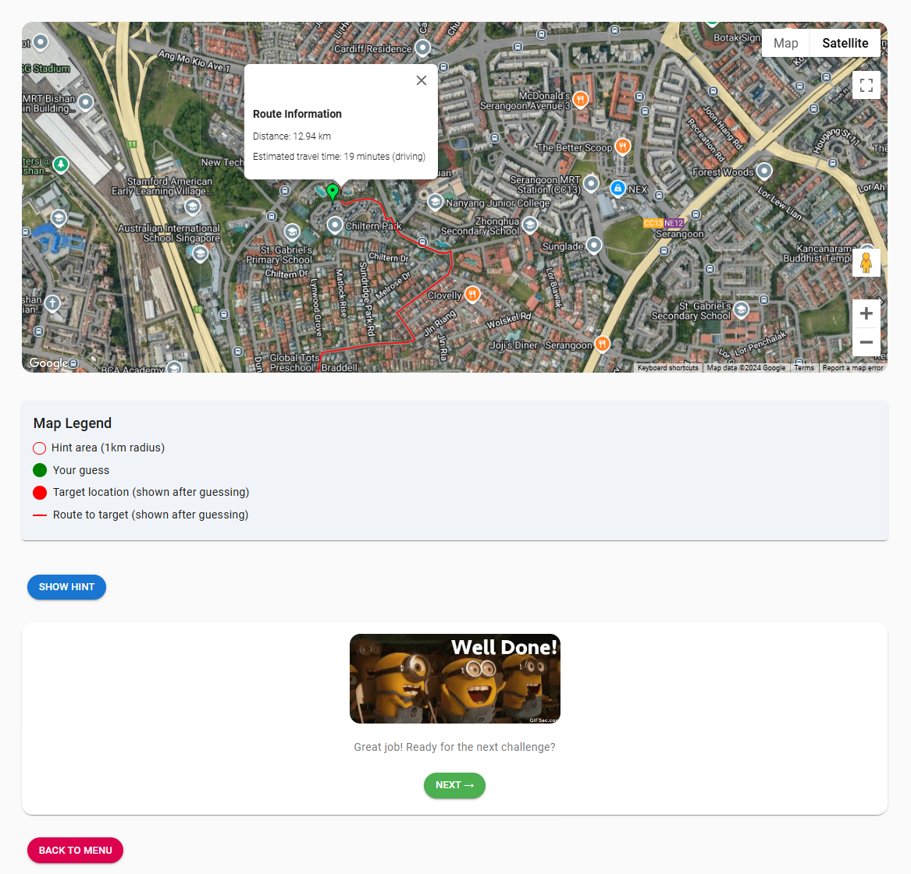

# Welcome to GeoQuest!🎉

GeoQuest is a game that allows you to explore the places around you which you may or may not know already, who knows you might find a hidden gem around you?

## How to run the files

1. Clone the repository to your local machine using:
```
git clone https://github.com/your-repo-url.git
```
2. Navigate to the project directory:
```
cd geoquest
```
3. Install the dependencies:
```
npm install
```
4. Start the development server:
```
npm start
```

### How to play the game

1. Edit your name in the home page, and click on the button to start the game.

2. The Street View image of the targetted location will be shown, and the map below is where all the markers can be seen, as well as your guess marker.

3. Below are the color indications of the markers.

4. Once you add the place, it will be reflected in the leaderboard page.

5. You can switch between 2D and 3D view, as well as Street View using the Pegman icon.


6. You have 3 guesses to guess the location, and the points will be calculated based on how close you are to the actual location. The scores are shown in the main page.
7. After you have made a correct guess(<=100m) or used all your guesses, you can start next quest or go back to main menu.


Feel free to explore the code and make improvements!